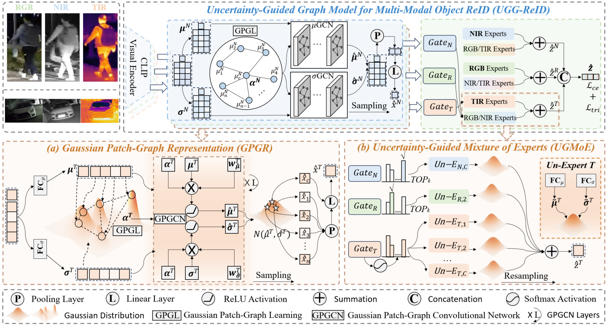

# UGG-ReID: Uncertainty-Guided Graph Model for Multi-Modal Object Re-Identification
Official PyTorch implementation of the paper:

**"UGG-ReID: Uncertainty-Guided Graph Model for Multi-Modal Object Re-Identification"**  
<!-- Authors: [Xixi Wan], [Aihua Zheng], [Bo Jiang], [Beibei Wang], [Chenglong Li], [Jin Tang]. -->
Authors: [Xixi Wan, Aihua Zheng, Bo Jiang, Beibei Wang, Chenglong Li, Jin Tang].

Accpected by [NeurIPS 2025] 
[[Paper]](..) [[arXiv]](https://arxiv.org/abs/2507.04638   ) 

---

## 📌 Abstract

 <!-- optional -->

Multi-modal object Re-IDentification (ReID) has gained considerable attention with the goal of retrieving specific targets across cameras using heterogeneous visual data sources.
At present, multi-modal object ReID faces two core challenges: (1) learning robust features under fine-grained local noise caused by occlusion, frame loss, and other disruptions; and (2) effectively integrating heterogeneous modalities to enhance multi-modal representation.
To address the above challenges, we propose a robust approach named Uncertainty-Guided Graph model for multi-modal object ReID (UGG-ReID). UGG-ReID is designed to mitigate noise interference and facilitate effective multi-modal fusion by \textbf{estimating both local and sample-level aleatoric uncertainty} and \textbf{explicitly modeling their dependencies}.
Specifically, we first propose the Gaussian patch-graph representation model that leverages uncertainty to quantify fine-grained local cues and capture their structural relationships. This process boosts the expressiveness of modal-specific information, ensuring that the generated embeddings are both more informative and robust. Subsequently, we design an uncertainty-guided mixture of experts strategy that dynamically routes samples to experts exhibiting low uncertainty. This strategy effectively suppresses noise-induced instability, leading to enhanced robustness. Meanwhile, we design an uncertainty-guided routing to strengthen the multi-modal interaction, improving the performance.
UGG-ReID is comprehensively evaluated on five representative multi-modal object ReID datasets, encompassing diverse spectral modalities. Experimental results show that the proposed method achieves excellent performance on all datasets and is significantly better than current methods in terms of noise immunity. 

---

## 🛠️ Setup

### 1. Clone the repository

```bash
git clone git@github.com:wanxixi11/UGG-ReID.git
cd UGG-ReID
```

### 2. Create environment
```
conda create -n UGG-ReID python=3.12.9
conda activate UGG-ReID
pip install -r requirement.txt
```

### 3. Prepare datasets

Download the datasets, and then unzip them to `./data`:
* RGBNT201: [Google Drive](https://drive.google.com/drive/folders/1EscBadX-wMAT56_It5lXY-S3-b5nK1wH?usp=sharing)
* MSVR310: [Google Drive](https://drive.google.com/file/d/1IxI-fGiluPO_Ies6YjDHeTEuVYhFdYwD/view?usp=drive_link)
* RGBNT100: [Baidu Pan](https://pan.baidu.com/s/1xqqh7N4Lctm3RcUdskG0Ug) (Code: rjin)
* WMVEID863: [Google Drive](https://drive.google.com/file/d/186Ep0YgHY0a8BQ1Z59HP1D2-kZazbH02/view?usp=drive_link)
* Market-MM: [Google Drive](https://drive.google.com/drive/folders/1EscBadX-wMAT56_It5lXY-S3-b5nK1wH)

Organize datasets as:
```
data/
├── RGBNT201/
│   ├── train_171/
│   └── test/
├── MSVR310/
│   ├── bounding_box_test/
│   ├── bounding_box_train/
│   └── query3/
├── RGBNT100/
│   └── rgbir
│      ├── bounding_box_test/
│      ├── bounding_box_train/
│      └── query/
├── WMVEID863/
│   ├── train/
│   ├── test/
│   └── query/
├── Market-1501-RGBNT/
│   ├── train/
│   ├── query/
│   └── gallery/
```

### 🚀 Training & 🧪 Evaluation

```
# RGBNT201 
CUDA_VISIBLE_DEVICES=0 python train.py --config_file configs/RGBNT201/UGG.yml
CUDA_VISIBLE_DEVICES=0 python test.py --config_file configs/RGBNT201/UGG.yml

# WMVEID863 
CUDA_VISIBLE_DEVICES=0 python train.py --config_file configs/WMVEID863/UGG.yml
CUDA_VISIBLE_DEVICES=0 python test.py --config_file configs/WMVEID863/UGG.yml

# MSVR310
CUDA_VISIBLE_DEVICES=0 python train.py --config_file configs/MSVR310/UGG.yml
CUDA_VISIBLE_DEVICES=0 python test.py --config_file configs/MSVR310/UGG.yml

# RGBNT100
CUDA_VISIBLE_DEVICES=0 python train.py --config_file configs/RGBNT100/UGG.yml
CUDA_VISIBLE_DEVICES=0 python test.py --config_file configs/RGBNT100/UGG.yml

```

### 📖 Citation

If you find our work helpful, please consider citing:

```
@inproceedings{wanuggreid,
  title = {UGG-ReID: Uncertainty-Guided Graph Model for Multi-Modal Object Re-Identification},
  author = {Wan, Xixi and Zheng, Aihua and Jiang, Bo and Wang, Beibei and Li, Chenglong and Tang, Jin},
  booktitle = NeurIPS,
  year={2025}(Accepted)
}
```
